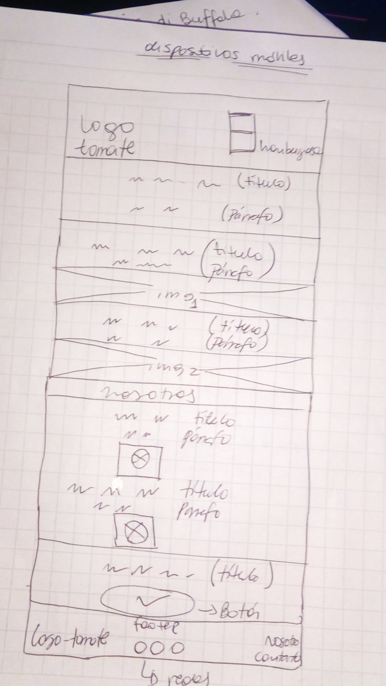

# Maqueta página "Tía Tomate"

# Requisitos generales
1. 	-Una página web tipo landing page la cual contiene:
   	- Barra de navegación y Footer.
   	- debe tener 5 secciones:

	- la primera el HEADER cual contiene el título.
	- la segunda contiene imágenes y descripción contando la historia de la empresa y procedencia 	de sus productos.
	- la tercera que contiene un segundo titulo "NOSOTROS".
	- la cuarta muestra a las personas cosechando sus productos(experiencias).
	- la quinta tiene un botón que invita a contactarse con el dueño de la marca (compra/venta).

	nombraré las secciones de la siguiente manera:
	1.- Header.
	2.- Blog.
	3.- Features.
	4.- Succsess.
	5.- porfolio.

	Etiquetas semanticas de html
	- nav.
	- header.
	- section.
	- footer.

	Definición de las clases en la página web:

	-	Para el navbar en general:  navbar__tiatomate
	-	Para la barra de navegación:  navbar__navigation
	-	para el header:  header__tiatomate
	
	- 	para el blog: classe blog
	  	al interior de los textos:  blog__inner 
	-	para las imagenes:  blog__inner__background
	  	En porfolio: clase porfolio 
	-	para todo el texto de aqui:  porfolio__inner
	-	para la imagen de arriba:  porfolio__inner__top
	-	para la imagen de abajo:  porfolio__inner__button
	-	Para el footer: footer__tiatomate

	-	para el boton de contacto:  buttons__tiatomate

# Requerimiento específico

2.	- La página debe ser responsiva.
	- Debe mostrar la pasión que siente por sus tomates.
	- Debe dar enfasis en la compra de sus productos. 
	- Debe mostrar el logo de la empresa.

# Requerimientos visuales

3.	- Layout: Debe usar Bootstrap.
	- Componentes: usaré grillas.

	- Contenidos: hincapié en la pasión por los tomates y la compra de este producto.

	- Estructura Visual
		-fuentes: usadas de "google fonts"

	- Tipografía: 
		para los titulos "Inconsolata" ( font-family: 'Inconsolata', monospace;)
		parrafos y otros elementos "Rufina" ( font-family: 'Rufina', serif;)

	- Colores: 
		base de todas las letras "negro (#262222)".
		para botones y backgrounds "rojo (#f94f1b)".
		para  barra de navegacion y footer "gris (#c4c1c0)".
		letras de barra de navegación y footer "white (#fcf6f4)".

	- Imágenes: contenidas dentro de carpeta imagenes.
				- imagen de tomates.
				- imagagenes personas cosechando sus toamtes.

	- Iconos: usare font-awesome.

# dibujo para pc

# dibujo para movil

# imagen de creación de directorios

