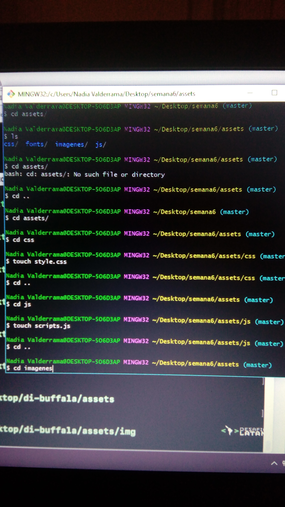

# Maqueta página "Tía Tomate"

# Requisitos generales

1. 	- Una página web tipo landing page la cual contiene:
   	- Barra de navegación y Footer.
   	- debe tener 5 secciones:

	- la primera el HEADER cual contiene el título.
	- la segunda contiene imágenes y descripción contando la historia de la empresa y procedencia 	de sus productos.
	- la tercera que contiene un segundo titulo "NOSOTROS".
	- la cuarta muestra a las personas cosechando sus productos(experiencias).
	- la quinta tiene un botón que invita a contactarse con el dueño de la marca (compra/venta).

2. nombraré las secciones de la siguiente manera:

	- Header.
	- Blog.
	- Features.
	- Succsess.
	- porfolio.

3. Etiquetas semanticas de html:

	- nav.
	- header.
	- section.
	- footer.

4. Definición de las clases en la página web:

	-Para el navbar en general:  navbar__tiatomate

	-Para la barra de navegación:  navbar__navigation

	-Para el header:  header__tiatomate
	
	-Para el blog: classe blog;
	  	al interior de los textos:  blog__inner 

	-Para las imagenes:  blog__inner__background

	En porfolio: clase porfolio;

	-para todo el texto de aqui:  porfolio__inner

	-para la imagen de arriba:  porfolio__inner__top

	-para la imagen de abajo:  porfolio__inner__button

	-Para el footer: footer__tiatomate

	-para el boton de contacto:  buttons__tiatomate

## Requerimientos específicos

5.	- La página debe ser responsiva.
	- Debe mostrar la pasión que siente por sus tomates.
	- Debe dar enfasis en la compra de sus productos. 
	- Debe mostrar el logo de la empresa.

## Requerimientos visuales

6.	- Layout: Debe usar Bootstrap.

	- Componentes: usaré grillas.

7.	- Contenidos: hincapié en la pasión por los tomates y la compra de este producto.

8.	- Estructura Visual

-fuentes: usadas de "google fonts"

9.	- Tipografía:

para los titulos "Inconsolata" ( font-family: 'Inconsolata', monospace;)

parrafos y otros elementos "Rufina" ( font-family: 'Rufina', serif;)

10.	- Colores: 

-base de todas las letras "negro (#262222)".
-para botones y backgrounds "rojo (#f94f1b)".
-para  barra de navegacion y footer "gris (#c4c1c0)".
-letras de barra de navegación y footer "white (#fcf6f4)".

11.	- Imágenes: contenidas dentro de carpeta imagenes.

imagenes de tomates.
imagenes de personas cosechando sus tomates.

12.	- Iconos: usare font-awesome.

### dibujo para pc

### dibujo para movil

### imagen de creación de directorios

